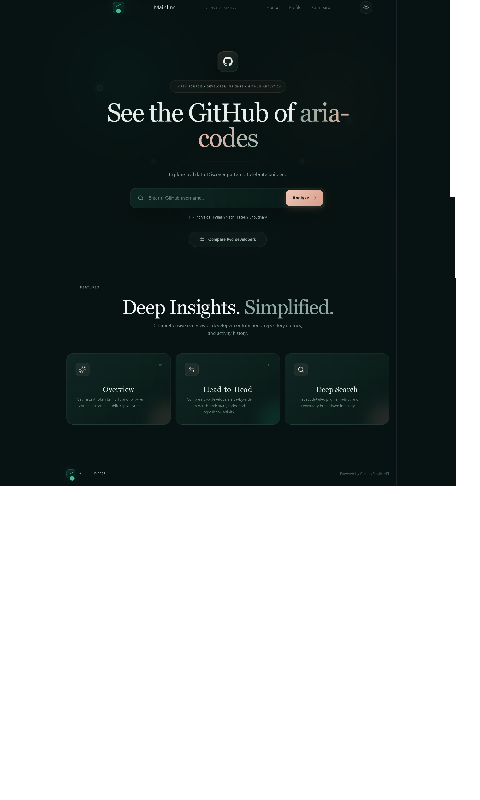

# Mainline: GitHub Developer Analytics Dashboard

See any GitHub profile, visualized beautifully. Search a developer's username to view their stats, repository breakdowns, activity insights, and compare two developers side by side.

> 🔗 *Live Demo:* https://git-hub-developer-analytical-dashbo.vercel.app/

---

## Features
- *Home / Search:* Enter any GitHub username to get started.
- *Profile Page:* View a developer's profile details, followers, following, public repositories, and overall stats.
- *Repository Breakdown:* Explore a user's repositories, including languages, stars, and forks.
- *Compare Page:* Compare two GitHub developers side by side.
- *Single Page App:* Smooth client-side navigation between pages with no full reloads.
- *Premium Dark UI:* A dark forest-green and teal theme with a clean, modern layout.

## Tech Stack
| Category | Technology |
| --- | --- |
| Frontend | React |
| Build Tool | Vite |
| Styling | CSS |
| Data Source | GitHub REST API |
| Linting | ESLint |

## Project Structure
React/
├── public/              # Static assets
├── src/
│   ├── assets/          # Images and icons
│   ├── App.jsx          # Root component and routes
│   ├── home.jsx         # Home / search page
│   ├── Profile.jsx      # Profile page
│   ├── Compare.jsx      # Compare page
│   ├── navbar.jsx       # Navigation bar
│   ├── main.jsx         # App entry point
│   └── *.css            # Styles for each page
├── index.html
├── package.json
├── vite.config.js
└── eslint.config.js

## Getting Started

### Prerequisites
- [Node.js](https://nodejs.org/) (v18 or higher)
- npm (comes with Node.js)
- [Git](https://git-scm.com/)

### Installation
1. *Clone the repository*

   bash
   git clone https://github.com/singhanujpratap8454/GitHub-Developer-Analytical-dashboard-.git
   

2. *Go into the project folder*
   bash
   cd GitHub-Developer-Analytical-dashboard-
   

3. *Install dependencies*

   bash
   npm install
   

4. *Start the development server*

   bash
   npm run dev
   

5. *Open the app* at [http://localhost:5173](http://localhost:5173)

### Build for Production

bash
npm run build

The production files are created in the dist/ folder. To preview the build locally:

bash
npm run preview

## How It Works

1. The user enters a GitHub username on the Home page.
2. The app requests data from the public [GitHub REST API](https://docs.github.com/en/rest).
3. The response is processed and displayed as stats and breakdowns on the Profile page.
4. On the Compare page, data for two users is fetched and shown side by side.

> *Note:* The GitHub API allows a limited number of unauthenticated requests per hour. If you hit the limit, wait a while and try again.

## Future Improvements

- Add more charts for commit and activity trends
- Add language usage charts
- Support GitHub token authentication for higher API limits
- Improve mobile responsiveness
- Add loading and error states for all pages

## Author

*Anuj Pratap Singh*
BCA Student | Aspiring Full Stack Developer

- GitHub: [@singhanujpratap8454](https://github.com/singhanujpratap8454)

---

If you like this project, consider giving it a ⭐ on GitHub.